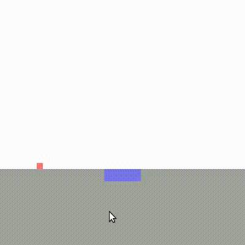
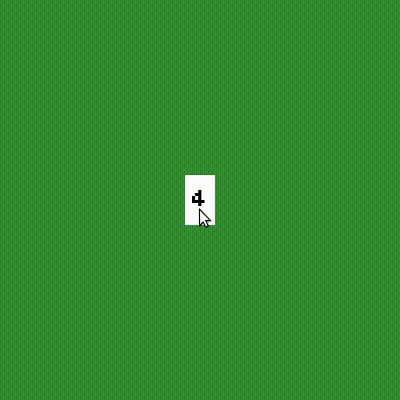

# TML

TML is a Time Machine Library for SDL.

The programmer can specify points in time to travel back and forth, and then
resume the simulation from there.

<p align="middle">
    <kbd>  </kbd>
    &nbsp; &nbsp; &nbsp; &nbsp;
    <kbd>  </kbd>
</p>

Simulations have two modes, which the programmer controls through the API:

1. Record mode:
    The simulation time moves forward, and TML internally records all events
    and periodic memory snapshots.
    This is the initial mode.
2. Time-travel mode:
    The simulation time freezes, and the programmer can specify a point in time
    to travel, which TML restores automatically.

When time travelling, TML restores the closest past snapshot and then simulates
the remaining events to reach the exact requested point in time.
Because TML relies on memory snapshots and deterministic simulation, there are
severe limitations in the programming API:

- No stateful calls are allowed (e.g., `rand`, `fopen`, etc).
- All memory state must be static and/or preallocated.

# Examples

- [jump.c]
    - `UP`: jump
    - `LEFT`: go back in time
- [cards.c]
    - `DRAG`: move cards
    - `ESC`: switch mode
        - use media controls to time travel

Compile as follows:

```
$ chmod +x jump.c
$ ./jump.c
$ ./xjump
```

# Simulation Structure

The programmer specifies a memory block, 4 callbacks, and then calls `tml_loop`
to pass control to the library:

```
// Simulation state
struct {
    ...     // (e.g., positions, state machine, memory pools)
} G;

// Simulation callback
void cb_sim (tml_evt evt) {
    ...     // given an input event, perform a simulation step
    ...     // (e.g., change positions, transit state, allocate objects)
}

// Effects callback
void cb_eff (int trv) {
    ...     // given the current mode, perform output effects
    ...     // (e.g., screen redraw)
}

// Record mode callback
int cb_rec (SDL_Event* sdl, tml_evt* evt) {
    ...     // given an SDL event, transform to a TML event
    ...     // returns status to quit, switch mode, or continue
    ...     // (e.g., receives SDL_KEYDOWN, returns TML_EVT_JUMP)
}

// Time-travel mode callback
int cb_trv (SDL_Event* sdl, int max, int cur, int* ret) {
    ...     // given an SDL event, time travel to `ret` tick
    ...     // receives max & cur simulation ticks
    ...     // returns status to quit, switch mode, or continue
    ...     // (e.g., go back in time given a special key)
}

int main (void) {
    ...     // static initialization
    tml_loop(50, sizeof(G), &G, cb_sim, cb_eff, cb_rec, cb_trv);
    ...     // static finalization
}
```

# API

- Loop call:

```
void tml_loop (
    int fps,                                // desired frame rate
    int mem_n,                              // simulation memory size in bytes
    void* mem_buf,                          // pointer to memory contents
    void (*cb_sim) (tml_evt),               // simulation callback
    void (*cb_eff) (int trv),               // effects callback
    int (*cb_rec) (SDL_Event*,tml_evt*),    // record mode callback
    int (*cb_trv) (SDL_Event*,int,int,int*) // time-travel mode callback
);
```

- Return status from `cb_rec` and `cb_trv`:

```
enum {
    TML_RET_NONE = 0,   // continue
    TML_RET_QUIT,       // quit simulation
    TML_RET_REC,        // switch to record mode
    TML_RET_TRV         // switch to time-travel mode
};
```

- Predetermined events passed to `cb_sim`:

```
enum {
    TML_EVT_INIT = 0,   // initialization event (cb_sim must reset memory)
    TML_EVT_TICK,       // tick event generated every 1/fps
    TML_EVT_NEXT        // reserved for user-defined events
};
```

- User-defined events returned from `cb_rec` and redirected to `cb_sim`:

```
enum {
    TML_EVT_XXX = TML_EVT_NEXT,     // starts from reserved TML_EVT_NEXT
    TML_EVT_YYY = ...               // (change XXX,YYY to meaningful names)
};
```

- Event data type:

```
typedef struct {
    uint8_t id;             // TML_EVT_INIT, TML_EVT_TICK, TML_EVT_XXX, ...
    union {
        int tick;           // current tick (TML_EVT_TICK)
        int i1;             // 1-int payload
        struct {
            int _1,_2;
        } i2;               // 2-int payload
        struct {
            int _1,_2,_3;
        } i3;               // 3-int payload
        struct {
            int _1,_2,_3,_4;
        } i4;               // 4-int payload
    } pay;
} tml_evt;
```
